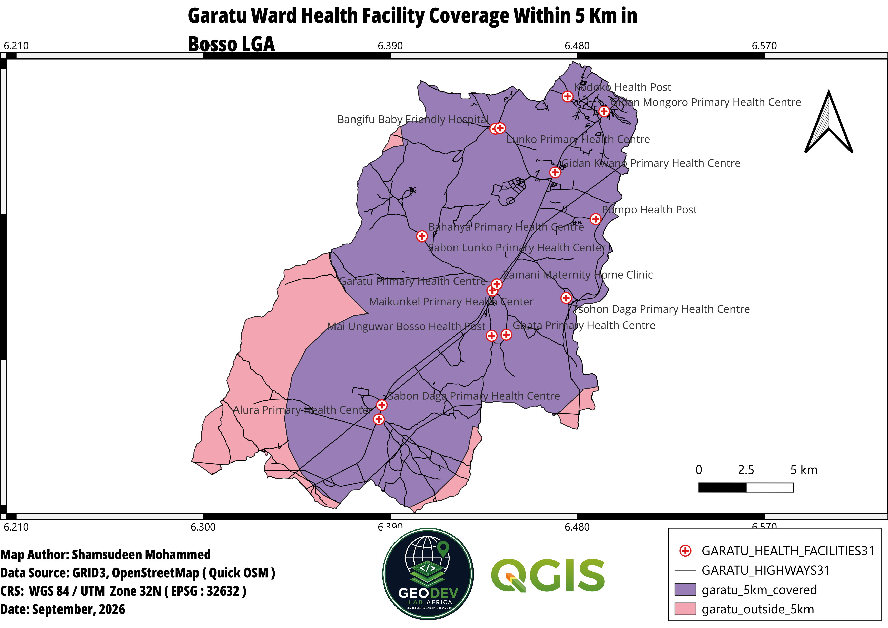

# Month 1 Summary

**GeoDev Lab Africa, Cohort One**  
**Author:** Shamsudeen Muhammad  
**Project:** Garatu Ward Health Facility Accessibility

---

## 1. The Question

> Which part of Garatu Ward, Bosso LGA, Niger State, falls within 5 km of a health facility, and which areas fall outside this 5 km accessibility zone?

---

## 2. What I Did

During the first month, I worked on preparing and analyzing spatial data for my health facility accessibility project in Garatu Ward, Bosso LGA, Niger State.

I started by identifying the datasets needed for the project, including ward boundaries, health facility locations, the LGA boundary, and road network data.

I then downloaded, opened, checked, and prepared the datasets in QGIS. I also reprojected the data to a suitable projected coordinate reference system and clipped the datasets to my study area.

In Week 4, I carried out my first spatial analysis by creating **5-kilometer buffers around health facilities** within the study area.

---

## 3. Spatial Operation

The main spatial operation I used was **Buffer**.

I created a 5-kilometer buffer around the health facility locations because my project question focuses on identifying areas that fall within 5 km of a health facility.

The overlapping buffer areas represent places that are within 5 km of one or more health facilities.

---

## 4. What I Expected

I expected the 5-kilometer buffers to show the parts of Garatu Ward that are within the defined accessibility distance of health facilities.

Areas covered by the buffers would represent areas within 5 km, while areas outside the buffers would represent areas beyond the 5-kilometer accessibility zone.

---

## 5. What I Found

The buffer analysis showed that several 5-kilometer buffer areas overlap because some health facilities are located within 5 km of one another.

The analysis also showed that the health facility coverage does not necessarily extend across the entire Garatu Ward.

This allows the ward to be examined in terms of areas covered by the 5-kilometer accessibility zone and areas outside it.

---

## 6. What Surprised Me

One thing I noticed was the amount of overlap between the 5-kilometer buffers.

At first, the overlapping circles made the map look more complicated, but I understood that this was expected because multiple health facilities can provide coverage to the same area.

---

## 7. Data Still Needed

Further analysis can be used to calculate the Total area of Garatu Ward and incorporate more detailed:
- road network data
- population data
- settlement locations
- and other relevant information to provide a more complete assessment of healthcare accessibility.

These values will provide a clearer measurement of health facility accessibility within Garatu Ward.

---

## 8. What I Learned

This month helped me understand how GIS analysis can be used to answer a real-world spatial question.

I learned how to prepare spatial data, work with coordinate reference systems, reproject and clip datasets, and apply a buffer operation for distance-based analysis.

I also learned the importance of checking spatial analysis results instead of assuming that the output is correct.

---

## 9. Month 1 Outcome

I completed my first spatial analysis for the project by creating 5-kilometer buffers around health facilities in Garatu Ward.

The map below shows the result of the Week 4 buffer analysis:

The analysis provides the basis for identifying areas of Garatu Ward that fall within and outside the defined 5-kilometer health facility accessibility zone.

---

**Status:** Month 1 complete.
